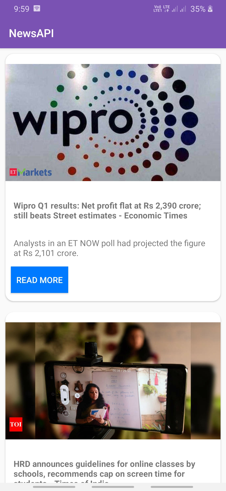
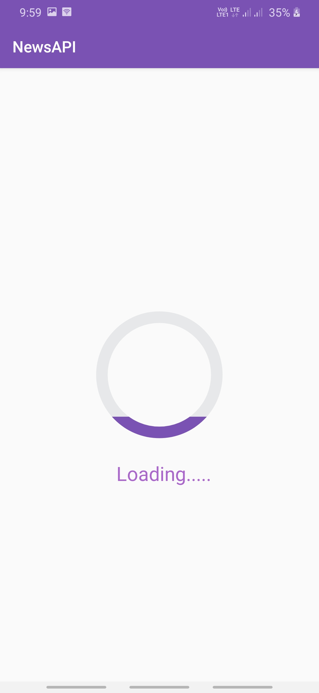

 # NewsAPI Android App
 The NewsAPI is a simple and easy to use REST API that returns JSON metadata for headlines currently published from over 30,000 news.

---

**Why News API ?**

- Everything is asynchronously cached for a   super-fast response.
- Jump right into a trial if you're in development.
- Get JSON results with simple HTTP GET requests.

---

### How to start News API ?

- Register at: `https://newsapi.org/`
- Explore Documentation :`https://newsapi.org/docs`

---

### Implementation Of NewsAPI in Android Application
- 
- 
- 

---
### Technology Used
- Java
- Json
- Xml

---

### IDE Used
- Android Studio

---

### Android Library Used
- **Picasso**
    - A powerful image downloading and caching library for Android.
    - More Details : `https://square.github.io/picasso/`
 - **Volley**
    - Volley is an HTTP library that makes networking for Android apps easier and most importantly.
    - More Details : `https://developer.android.com/training/volley`
  - **CardView**
    - More Details : `https://developer.android.com/reference/androidx/cardview/widget/CardView`
  - **Recyclerview**       
    - More Details : `https://developer.android.com/jetpack/androidx/releases/recyclerview?hl=en`
  - **Webview**
    - More Details : `https://developer.android.com/guide/webapps/webview`

  ---    

## FAQ

- **Is News API is free Services?**
    - Yes,it is totally free for beginner.

---

## Contact Us

Reach out to me at one of the following places!

- Email at <a href="zlite147@gmail.com" target="_blank">`zlite147@gmail.com`</a>

---
